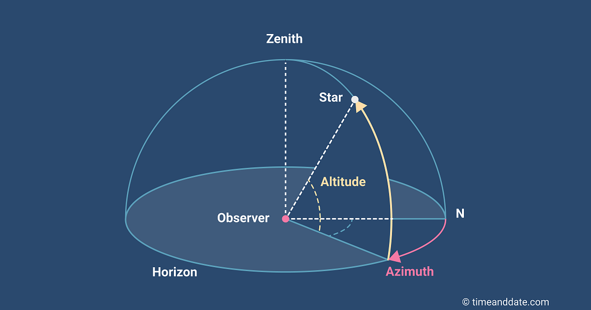

# Finding the Correct Camera Orientation

The orientation of the camera system can be define in the azimuth-elevation spherical coordinate system.\

The azimuth represents the rotation around the vertical axis.

The elevation(altitude) represents the rotation above or below the horizontal plane.

These parameters can be assigned as angles in the C programming language:

azimuth = theta

elevation = phi&#x20;

X = 0&#x20;

Y = 1&#x20;

Z = 0

theta = atan2f(Vy\[Y], Vx\[X]);

phi = asinf(Vz\[Z]);

Now we can use the correct two rotation matrices in combination to define the orientation of the camera relative to the world coordinate system.

$$R = Ry(theta)  \cdot Rx(phi)$$

$$Ry(theta) = \begin{bmatrix} cos(theta) & 0 & sin(theta)\\ 0 & 1 & 0\\ -sin(theta) & 0 & cos(theta)\end{bmatrix}$$

$$Rx(phi) = \begin{bmatrix} 1& 0 & 0\\ 0 & cos(phi) & -sin(phi)\\ 0 & sin(phi) & cos(phi)\end{bmatrix}$$
